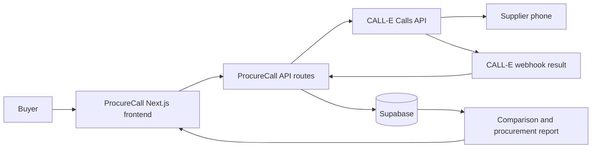

# ProcureCall

## AI-Powered Autonomous Procurement Agent

ProcureCall is a CALL-E-powered procurement workspace that performs supplier outreach by phone, captures the commercial information discussed, and turns call data into structured procurement reports. A buyer can attach one or more suppliers to a request, compare returned offers, and review a recommendation with the underlying evidence visible.

## What Is ProcureCall?

ProcureCall addresses a practical phone-work problem in procurement. Buyers need to contact suppliers, ask consistent questions, gather price, availability, delivery, payment, and fulfillment information, and compare answers that may arrive in different forms. Manually calling and recording several suppliers takes time and makes omissions easy.

ProcureCall uses CALL-E for outbound supplier conversations and structured result fields to make the returned procurement information easier to review.

## The Problem

Supplier quotation gathering often requires repetitive calls:

- A buyer must contact each supplier separately.
- Important terms can be inconsistent or missing between conversations.
- Price, availability, delivery, minimum order, payment terms, and fulfillment must be captured together for a useful comparison.
- Manual notes make it difficult to preserve evidence and identify the strongest available match.

## The Solution

ProcureCall turns one procurement request into a repeatable supplier-call workflow. The buyer enters the requirement and attaches supplier phone numbers. ProcureCall creates an outbound CALL-E call for each eligible supplier using the same procurement brief and a structured result schema. Results are stored per supplier and displayed as readable offer cards rather than raw provider JSON.

## How It Works

```text
Procurement Request
  -> Attached Suppliers
  -> CALL-E Supplier Outreach
  -> Supplier Response
  -> Structured Result and Evidence
  -> Multi-Supplier Comparison
  -> Supplier Ranking
  -> Recommendation
  -> Procurement Report
```

The implemented workflow is:

1. The buyer creates a request with a product or service, quantity, target budget, delivery location, and instructions.
2. The buyer attaches one or more supplier phone numbers.
3. ProcureCall sends an asynchronous call request to CALL-E for each eligible supplier.
4. CALL-E conducts the phone conversation and finalizes the requested result.
5. CALL-E sends the result to the ProcureCall webhook. ProcureCall also records the accepted call as queued and can reconcile pending calls by querying CALL-E while results are polled.
6. The review and dashboard pages display call status, structured offers, evidence, comparison cards, and a recommendation.

## Why CALL-E?

This is a phone-work problem, not only a chatbot problem. Supplier information is obtained by asking a person directly about current price, availability, delivery, commercial terms, and whether the request can be fulfilled.

CALL-E gives ProcureCall outbound phone-call capability. It can contact the supplier, ask the procurement task, and return a finalized summary and structured result after the conversation. ProcureCall handles the procurement-specific storage, interpretation, comparison, and reporting around that call.

## Key Features

- AI-assisted supplier calls through CALL-E
- Multiple supplier phone numbers attached to one request
- Separate result storage for each supplier call
- Structured supplier offer cards
- Price and currency
- Availability
- Delivery time
- Minimum order
- Payment terms
- Additional fees
- Fulfillment status
- Supplier notes
- Readable evidence presentation
- Multi-supplier comparison
- Ranking rationale
- Recommended supplier indicator
- Procurement review, dashboard, and report views
- Queued, in-progress, completed, and failure-oriented call states
- Duplicate protection for completed or active supplier calls

## Agent Workflow

### Before the call

ProcureCall collects the procurement requirement and attached supplier phone numbers. The backend builds a call task containing the buyer's requirement and questions about price, currency, availability, minimum order, delivery time, payment terms, and additional fees. It also sends a result schema requiring the supplier fulfillment status and these commercial fields.

### During the call

CALL-E handles the outbound phone conversation with the supplier. ProcureCall does not wait for the phone call inside the initial web request; it returns a queued call response so the application remains responsive.

### After the call

CALL-E sends the finalized result to `/api/calle/webhook`. ProcureCall stores the call status, summary, structured result, completion information, and evidence in `call_results`. The UI polls for updates, displays the result, and keeps supplier offers separate for comparison.

## Multi-Supplier Intelligence

One request can contain several supplier records. Each outbound call includes the request ID and supplier ID in CALL-E metadata, and each saved result also contains the CALL-E call ID. This prevents one supplier's result from replacing another supplier's result.

The current ranking logic considers:

- Fulfillment status, with confirmed fulfillment preferred.
- Whether a quoted price is available for comparison.
- Whether availability information is present.
- Whether delivery information is present.
- How complete the procurement terms are across price, availability, delivery, minimum order, payment terms, and additional fees.

The recommendation is decision support. It does not authorize a purchase and does not claim that a price is comparable when currencies, units, or quote formats differ.

## Requirement Matching and Cost Interpretation

When the structured result contains usable numeric values, ProcureCall
calculates cost at the requested quantity and cost at the supplier's minimum
order quantity. It adds a reported additional fee when it can extract one,
then compares the estimated minimum-order total with the buyer's budget.
The review UI shows requested quantity, required quantity after MOQ, product
subtotal, fees, estimated total, budget state, and concise match states for
quantity, budget, availability, and delivery information.

Calculated values are labeled as estimates. Values that were not provided by
the supplier remain unknown, and a completed phone call is not treated as a
successful procurement match.

## Example

The following is illustrative and is not a recorded call result:

```text
Requirement: source a specified quantity of a product for delivery to a target location
  -> attach Supplier A and Supplier B
  -> CALL-E contacts both suppliers
  -> ProcureCall receives each structured offer separately
  -> buyer reviews price, fulfillment, availability, delivery, and terms
  -> ProcureCall highlights the strongest available match
```

No supplier outcome, price, phone number, or real-world result is claimed by this example.

## Architecture



The relevant runtime components are:

- Next.js App Router pages for request creation, review, dashboard, and reports.
- Next.js API routes for procurement requests, supplier calls, result reads, and webhook handling.
- CALL-E for outbound call creation and completed call results.
- Supabase for `procurement_requests`, `suppliers`, and `call_results` data.
- OpenNext and Cloudflare Workers for the deployed application runtime.

## Technology Stack

- Next.js `16.3.1`
- React `19.2.8`
- TypeScript
- `@call-e/calle` `^0.6.0`
- `@supabase/ssr`
- `@supabase/supabase-js`
- `@opennextjs/cloudflare` `^1.20.2`
- Wrangler `^4.123.0`
- Tailwind CSS

## CALL-E Integration

The production supplier-call route sends a `POST` request to:

```text
https://api.heycall-e.com/v1/calls
```

The request includes a procurement task prompt, supplier phone recipient data, a structured result schema, procurement and supplier metadata, the ProcureCall webhook URL, and a stable idempotency key per request and supplier.

The separate test-call route uses the installed `@call-e/calle` SDK's `createAndWait` method. The production procurement route intentionally starts calls asynchronously because a Cloudflare Worker should not remain waiting for an entire phone conversation.

## Data & Results

The application stores procurement requests and supplier records in Supabase. Each finalized call result stores the request ID, supplier ID, CALL-E call ID, status, task completion, completion confidence, summary, structured result, and evidence.

The UI interprets the structured result into labeled fields and turns evidence into readable statements. This documentation does not expose secret values, private URLs, phone numbers, or database credentials.

## Deployment

The production branch is:

```text
production-hardening
```

ProcureCall uses OpenNext to generate a Cloudflare Worker bundle.

```text
Build command:
npm run build:cloudflare

Production deploy command:
npm run deploy:cloudflare
```

The production deploy script runs:

```bash
npm run build:cloudflare && npx wrangler deploy
```

The OpenNext build generates `.open-next/worker.js` and `.open-next/assets`. Preview or non-production branch uploads use:

```bash
npm run version:cloudflare
```

Cloudflare configuration is defined in `wrangler.jsonc`, which points Wrangler to the OpenNext Worker entrypoint and asset directory and enables `nodejs_compat`.

## Local Development

Prerequisites:

- Node.js and npm
- A Supabase project configured for the application's tables
- A CALL-E API key

Install dependencies:

```bash
npm install
```

Create `.env.local` with the required variable names and your local values. Start the development server:

```bash
npm run dev
```

Open `http://localhost:3000`.

To build the Cloudflare version locally:

```bash
npm run build:cloudflare
```

## Environment Variables

Variable names only:

```text
CALLE_API_KEY
NEXT_PUBLIC_SUPABASE_URL
NEXT_PUBLIC_SUPABASE_ANON_KEY
SUPABASE_SERVICE_ROLE_KEY
```

Never commit `.env.local`, API keys, service-role keys, or other secret values.

## Production Readiness

The repository has verified the following build paths during development:

- `npm run build` completes the Next.js production build.
- `npm run build:cloudflare` completes the OpenNext Cloudflare build.
- The OpenNext build generates `.open-next/worker.js`.
- The OpenNext build generates `.open-next/assets`.
- `npx wrangler deploy --dry-run` packages the generated Worker and assets.
- `npx wrangler versions upload --dry-run` packages the preview version.

Generated `.next`, `.open-next`, and local environment files are ignored and are not intended to be committed.

## Limitations and Failure Handling

- Supplier calls are asynchronous and may remain queued or in progress before a result is available.
- A supplier may not answer, may fail, or may return incomplete information.
- Price comparison is only a ranking signal when a quoted price is present; the application does not normalize every possible currency or unit.
- Webhook delivery may be delayed. The result read path can reconcile pending calls with CALL-E while the UI polls.
- The recommendation is a review aid, not an automatic purchase decision.
- A live CALL-E account, Supabase configuration, and valid deployment secrets are required for real phone calls.

## Hackathon Context

ProcureCall was built for the CALL-E hackathon, **CALL-E: Your Code Is Calling**. The project focuses on applying autonomous outbound phone work to a real procurement workflow: gathering supplier information, preserving the resulting evidence, and helping a buyer compare offers.

## Demo

- Live demo URL: `[add live demo URL]`
- Demo video: `[add demo video URL]`

No live URL or video URL is claimed until one is provided.

## Submission Checklist

- Devpost submission: `[add Devpost URL]`
- Demo video: `[add demo video URL]`
- Live demo: `[add live demo URL]`
- CALL-E account email: `[add account email]`
- Awesome Phone Call Agents pull request: `[add pull request URL]`
